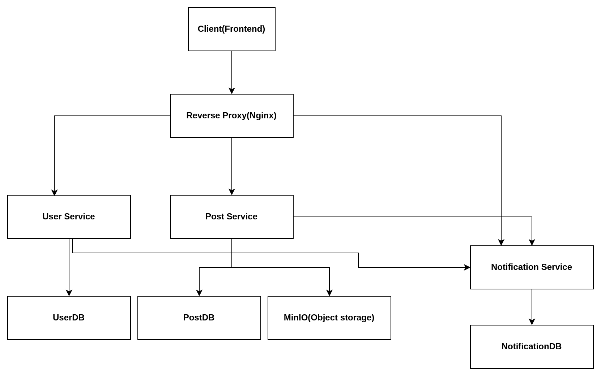

# LinkedIn
 A simple social media application for Distributed Systems

 MinIO setup has been done following Abhijit's tutorial and documentation.

Issues can be faced during fetching image buffer from object storage to frontend


Notification module has been added without remove functionality. Jwtauthentication has been implemented on backend


#If code is changed
turn off docker using

```docker-compose down```

rebuild service

```docker-compose build```

start service
``` docker-compose up```

##IMPORTANT FOR NGINX
Build the file
```docker build -t nginxservice .```

Run the container

```docker run --name nginxservice -p LOCAL_PORT:DOCKER_PORT -d nginx```


Careful about the ports of nginx image and outside port. In my case I used 8080 as the localport and 80 as docker port.

The microservice architecture of the project is attached below:

